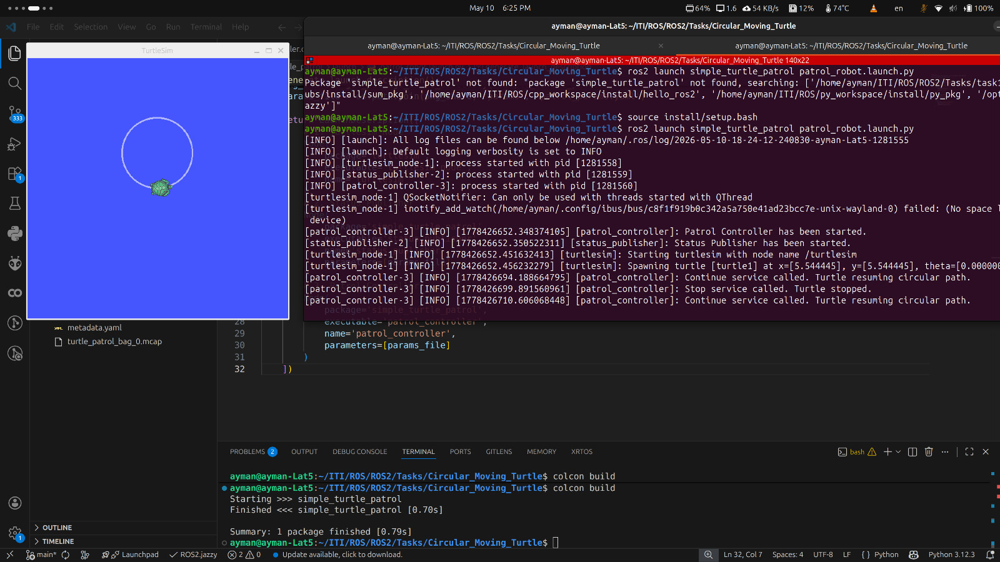

# 🐢 Circular Moving Turtle (ROS 2 Complete Project)

This project is a modular ROS 2 application that controls a **Turtlesim** robot to move in a circular path. It features custom message interfaces, parameter-based configurations, and service-based control logic (Stop/Start).


---

## 💡 Project Concept
The core idea is to create a "Patrol System" where:
1.  A **Controller Node** moves the turtle in a circle.
2.  A **Status Node** monitors the turtle's position and calculates "Laps" (full rotations).
3.  The user can interact with the system via **Services** to stop or resume the patrol.
4.  All data is logged using **ROS 2 Bags** for later analysis.

---

## 📂 Project Architecture (Files & Logic)

### 1. Custom Interface: `msg/RobotStatus.msg`
We defined a custom message to aggregate all important data in one topic:
*   `geometry_msgs/Pose pose`: Current X, Y, and Theta.
*   `string state`: Current status ("running" or "stopped").
*   `float32 temperature`: A simulated temperature value based on speed.
*   `int32 lap_count`: The number of full $2\pi$ rotations completed.

### 2. The Controller: `src/patrol_controller.cpp`
*   **Purpose:** Commands the turtle to move.
*   **Logic:** Uses a `WallTimer` to publish `geometry_msgs/msg/Twist` to `/turtle1/cmd_vel`.
*   **Services:** Provides `/stop` and `/continue` services (using `std_srvs/srv/Empty`) to toggle the movement logic.
*   **Parameters:** Reads `linear_speed` and `angular_speed` from a YAML file.

### 3. The Monitor: `src/status_publisher.cpp`
*   **Purpose:** High-level monitoring and telemetry.
*   **Lap Counting Logic:** It subscribes to `/turtle1/pose`. By tracking the delta (change) in `theta` and accumulating it, the node detects when a full $360^\circ$ ($2\pi$ rad) rotation occurs.
*   **Publisher:** Sends the `RobotStatus.msg` data to the `/robot/status` topic.

### 4. Configuration: `params/patrol_params.yaml`
Allows changing the robot's behavior without recompiling the code:
```yaml
patrol_controller:
  ros__parameters:
    linear_speed: 1.5
    angular_speed: 1.0

```

### 5. Automation: `launch/patrol_robot.launch.py`

A Python launch script that starts the `turtlesim_node`, `patrol_controller`, and `status_publisher` simultaneously with the correct parameters.

---

## 🛠️ Step-by-Step Execution Guide

### 1. Workspace & Package Creation

```bash
# Create Workspace
mkdir -p ~/ITI/ROS/ROS2/Tasks/Circular_Moving_Turtle/src
cd ~/ITI/ROS/ROS2/Tasks/Circular_Moving_Turtle/src

# Create Package
ros2 pkg create --build-type ament_cmake simple_turtle_patrol --dependencies rclcpp turtlesim geometry_msgs std_msgs std_srvs

```

### 2. Build the Project

```bash
cd ~/ITI/ROS/ROS2/Tasks/Circular_Moving_Turtle
colcon build --symlink-install
source install/setup.bash

```

### 3. Running the Project

Launch everything at once:

```bash
ros2 launch simple_turtle_patrol patrol_robot.launch.py

```

### 4. Controlling the Robot (Start/Stop)

While the launch file is running, open a new terminal (and source it) to use the services:

* **To Stop:** `ros2 service call /stop std_srvs/srv/Empty {}`
* **To Start:** `ros2 service call /continue std_srvs/srv/Empty {}`

### 5. Monitoring the Status

```bash
ros2 topic echo /robot/status

```

---

## 📊 Data Logging (ROS Bag)

To record all topics (including our custom status) for submission:

```bash
# Record
ros2 bag record /robot/status /turtle1/cmd_vel /turtle1/pose -o turtle_patrol_bag

# Check Bag Info
ros2 bag info turtle_patrol_bag

```
